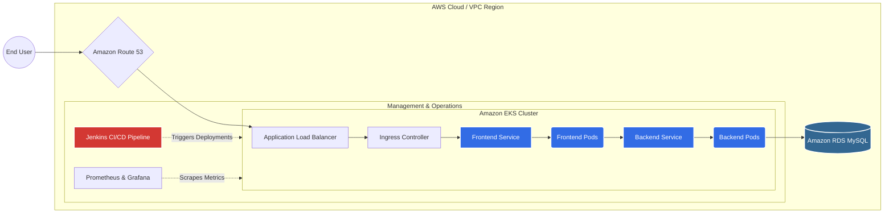

# AWS Cloud & Microservices Infrastructure Automation 🚀

Welcome to my DevOps portfolio repository. This project demonstrates a complete, production-grade DevOps lifecycle for a multi-tier microservices architecture (Myapp App & RoboShop) deployed on Amazon Web Services (AWS). 

It encompasses Infrastructure as Code (IaC), container orchestration, automated CI/CD pipelines, and observability.

---

## 🏗️ Architecture Topology

The following diagram illustrates the traffic flow and deployment architecture of the microservices running on AWS.

--- 

## ⚙️ Core Implementations

**1. Infrastructure Provisioning (Terraform)** 

Built modular, version-controlled Terraform scripts to provision AWS VPCs, subnets, routing tables, and security groups.

Provisioned an Amazon EKS cluster with managed node groups for high-availability compute workloads.

Implemented S3 remote backend with DynamoDB state locking to prevent race conditions during collaborative deployments.

---

**2. Configuration Management (Ansible)**

Developed custom Ansible Roles to automate OS-level configuration, dependency management, and application runtime setups across Linux instances.

Used dynamic inventories to apply configurations securely without manual SSH intervention.

---

**3. Containerization & Orchestration (Docker, Helm, EKS)**

Containerized polyglot microservices (Java, Python, NodeJS) using highly optimized, multi-stage Dockerfiles to reduce image size and attack surface.

Automated Kubernetes deployments using Helm Charts, managing deployments, services, ingress controllers, and persistent volumes.

Configured Horizontal Pod Autoscalers (HPA) to scale microservices dynamically based on CPU/Memory utilization thresholds.

---

**4. CI/CD Automation (Jenkins)**

Architected end-to-end declarative pipelines using Jenkins.

Built a custom Jenkins Shared Library (Groovy) to standardize pipeline stages (Build, Test, SonarQube Scan, Docker Build/Push, Helm Deploy) and eliminate duplicate pipeline code across 20+ microservices.

---

**5. Observability (Prometheus)**

Deployed and configured Prometheus inside the EKS cluster for centralized scraping of cluster metrics, pod health, and application logs.

---

**Let's Connect!**

If you have questions about this architecture or want to discuss DevOps, cloud-native engineering, and SRE best practices, feel free to reach out.
 
 🔗 LinkedIn: linkedin.com/in/saikumarsingari
 📧 Email: srv.nagasaikumar@gmail.com